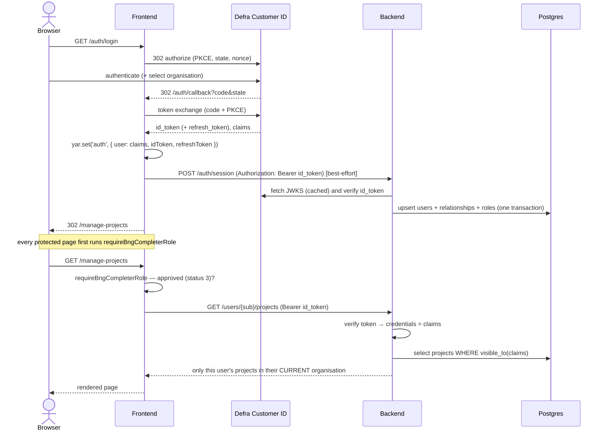

# Authenticated user journey (Defra Customer ID)

This document describes what happens for an **authenticated user end to end** —
from sign-in, through identity persistence and per-request authorisation, to
token refresh and sign-out — and how the live **Defra Customer ID** service
differs from the local **cdp-defra-id-stub**.

It complements [authentication.md](./authentication.md) (which focuses on the
OIDC login mechanics) by following the user _through_ the system once they are
signed in, across both the frontend (`bng-metric-frontend`) and the backend
(`bng-metric-backend`).

## Actors

| Actor                 | Role                                                         |
| --------------------- | ------------------------------------------------------------ |
| **Browser**           | The BNG completer using the service                          |
| **Frontend**          | Hapi + Nunjucks app (port 3000); holds the user session      |
| **Backend**           | Hapi API (port 3001); owns project data + RBAC               |
| **Defra Customer ID** | OIDC provider (Azure AD B2C live; cdp-defra-id-stub locally) |
| **Session store**     | Redis (deployed) / in-memory (dev) behind `yar`              |

The guiding principle is **zero-trust between frontend and backend**: the
frontend authenticates the user and forwards their id_token, but the backend
**independently verifies that token** and derives all identity and authorisation
from it — it never trusts a `userId` in a request body.

## End-to-end lifecycle

### 1. Sign-in (frontend)

`/auth/login` → `/auth/callback` runs the OIDC authorization-code flow with PKCE
(`src/server/auth/controller.js`, `src/server/common/helpers/auth/oidc-client.js`).
On success the callback stores `{ user: claims, idToken, refreshToken }` in the
`yar` session under the `auth` key. See [authentication.md](./authentication.md)
for the PKCE/nonce details.

### 2. Identity persistence (frontend → backend, best-effort)

Immediately after the session is stored, the callback POSTs the id_token to
`{backend}/auth/session`
(`src/server/common/helpers/auth/persist-session.js`). The backend verifies the
token and **upserts** the user's identity into Postgres in one transaction:

- `bng.users` — `user_id` (the token `sub`), email, names, `last_login`
- `bng.relationships` — one row per org relationship in the token
- `bng.roles` — one row per role, **including its status**

This is **best-effort**: a failure is logged and metered
(`BackendSessionPersistFailed`) but never blocks sign-in. Rows are only ever
upserted (never deleted), so access removed at the IdP arrives on the next login
as a status change (6/7), not a missing row.

### 3. Authorisation gate (frontend, every protected page)

Every protected route runs the `requireBngCompleterRole` pre-handler
(`src/server/common/helpers/auth/verify-role.js`). A user may use the service
only if they hold an **approved** `bng completer` role — role name
`bng completer` **and** status `3` (Complete – approved). When the token carries
a `currentRelationshipId`, the approved role must be for that relationship.

Any other status (`1` pending, `2`, `4`–`7` rejected/removed) → redirect to
`/auth/forbidden` ("Access denied"). This deliberately matches the backend RBAC
so an unapproved user gets a clear message instead of silently empty pages.

### 4. Per-request authorisation (backend RBAC)

Every backend call the frontend makes on the user's behalf carries
`Authorization: Bearer <id_token>` (added centrally by
`src/server/common/helpers/auth/backend-request.js` /
`auth-headers.js`). The backend's `defra-jwt` auth strategy
(`bng-metric-backend/src/plugins/auth-jwt.js`) verifies the token against the
provider's JWKS and sets `request.auth.credentials` to the **verified** claims.

Project rows are then filtered by a reusable visibility predicate
(`bng-metric-backend/src/db/project-visibility.js`). A project is visible to the
requesting `sub` when **all** of the following hold:

- they own it (`user_id` = the verified token `sub`), **and**
- it belongs to the org context they are acting in **right now** — its
  `relationship_id` matches their current relationship, **and**
- either it has no relationship (legacy row — owner-fallback), or their latest
  role for that `relationship_id` is **status 3**.

The org scope is what keeps a multi-org user's projects apart (BMD-890). A user
can hold an approved `bng completer` role in several organisations at once;
without it, a project created under org A stayed visible after switching to
org B, because the role check passed for _both_ relationships. Switching back to
org A shows org A's projects again — they are scoped, not lost.

The current relationship comes from the verified token's `currentRelationshipId`,
falling back to the `current_relationship_id` that `bng.users` recorded at the
last sign-in. The fallback matters because Defra ID runs its relationship/role
enrichment only on interactive sign-in, so an id_token obtained through a
`refresh_token` grant can arrive with those claims blank (see
[silent refresh](#5-token-expiry--silent-refresh-frontend)) — without it, a
silent refresh would empty the user's project list.

New projects are stamped with the creator's `org_id` / `relationship_id` derived
from the verified token (`currentRelationshipId`), never from the request body.
Single-row endpoints return **404** (not 403) when a project exists but isn't
visible, to avoid leaking its existence — including for a project of the user's
own that belongs to a different organisation.

On the frontend side, changing organisation ("Change organisation" →
`/auth/login?forceReselection=true`) re-runs the interactive sign-in. The
callback clears the journey state scoped to the org just left — pending upload
ids, upload errors and validation-error lists
(`src/server/common/helpers/auth/organisation-switch.js`) — so nothing pointing
at the previous org's project survives the switch. Signing in again as the
_same_ organisation leaves the journey intact.

The backend is **secure by default**: it sets `defra-jwt` as the server-wide
default auth strategy, so _every_ route requires a verified token unless it
explicitly opts out (only `/health` and the static `/reference/*` lookups do).
This means the frontend forwards the bearer on the upload and validation calls
too — `initiateUpload` / `getUploadStatus`
(`src/server/common/services/uploader.js`) and `validateBaseline` /
`validatePostIntervention` (`src/server/common/services/baseline.js`) all go
through `backendRequest`. See the backend's
[auth route policy](../../bng-metric-backend/docs/auth-route-policy.md) for the
allowlist and the guard test that enforces it.

### 5. Token expiry & silent refresh (frontend)

The stored id_token is the bearer for all backend calls and expires (~hours). On
a `401` from the backend, `backend-request.js` performs **one silent refresh**
via the OIDC refresh grant (`refresh-session.js` → `openid-client`
`refreshTokenGrant`), re-stores the new `id_token`/`refresh_token` in `yar`, and
retries the call once. If the refresh fails, the original error surfaces and the
user is sent back through sign-in. (The `yar` session lifetime should be aligned
with / outlive the token lifetime so refresh can run.)

### 6. Sign-out

`/auth/logout` resets the `yar` session and redirects to the provider's
end-session endpoint with `id_token_hint`, which returns to `/auth/signed-out`.

## What the token carries

Defra Customer ID id_token claims used by the service:

| Claim                            | Used for                                                                                                   |
| -------------------------------- | ---------------------------------------------------------------------------------------------------------- |
| `sub`                            | The canonical user id (`bng.users.user_id`, project `user_id`)                                             |
| `email`, `firstName`, `lastName` | Stored on `bng.users` (PII — never logged)                                                                 |
| `relationships[]`                | `relationshipId:organisationId:organisationName:organisationLoa:relationship:relationshipLoa`              |
| `roles[]`                        | `relationshipId:roleName:status`                                                                           |
| `currentRelationshipId`          | The org context the user is acting in; drives project stamping + the per-relationship authorisation checks |

Organisation names may themselves contain `:`, so parsers
(`bng-metric-backend/src/services/defra-id/claims.js`) rebuild the name from the
middle fields rather than taking `parts[2]`.

## Expectations of an authenticated user

- **Approved (`bng completer` status 3) for their current org** → full use:
  create projects, upload baselines, edit habitats, see their own projects.
- **Signed in but not approved** (pending/rejected/removed `bng completer`) →
  reaches `/auth/forbidden` on every BNG page. They are authenticated but
  **unauthorised**.
- **Approved for org A, currently acting as org B (unapproved)** → unauthorised
  while in the B context; projects are per-relationship.
- **Legacy projects** (created before RBAC, no relationship) stay visible to
  their original creator regardless of role status.
- A user can never see or modify another user's projects — `GET /projects` and
  `GET /users/{id}/projects` are both scoped to the verified `sub`.

## Defra Customer ID vs the cdp-defra-id-stub

The stub is wire-compatible enough for local development but differs in several
ways that the code accounts for:

| Aspect                   | Defra Customer ID (live B2C)                                           | cdp-defra-id-stub (local)                                                                                                |
| ------------------------ | ---------------------------------------------------------------------- | ------------------------------------------------------------------------------------------------------------------------ |
| Discovery URL            | Per-environment B2C metadata URL                                       | `http://localhost:3200/cdp-defra-id-stub/.well-known/openid-configuration`                                               |
| Client secret            | AWS Secrets Manager (`@defra/hapi-secure-context`)                     | `test_value` default                                                                                                     |
| Authorize scope          | `OIDC_SCOPES` **with the clientId appended** (B2C resource-scope rule) | `OIDC_SCOPES` as-is (`OIDC_USE_STUB=true`)                                                                               |
| Nonce                    | Echoed in the id_token; `openid-client` enforces it strictly           | Not emitted; `expectedNonce` is omitted, with a manual fallback check                                                    |
| Token `aud`              | Carries the application clientId                                       | Does **not** append the clientId                                                                                         |
| Backend audience check   | Enforce `aud` = clientId (set `OIDC_AUDIENCE`)                         | **Relaxed** — audience only enforced when `OIDC_AUDIENCE` is set, so leave it unset until a live stub `aud` is confirmed |
| Backend issuer           | From discovery (or `OIDC_ISSUER`)                                      | From discovery (or `OIDC_ISSUER`)                                                                                        |
| JWKS for verification    | `createRemoteJWKSet` from discovery `jwks_uri`                         | Same in normal runs; integration tests inject a local JWKS via `OIDC_LOCAL_JWKS`                                         |
| Role status              | Managed by a Defra administrator; a real BNG completer is approved (3) | **You set it yourself** at registration — you must choose **status 3**, or every BNG page shows "Access denied"          |
| Token lifetime / refresh | Real expiry; silent refresh exercised in normal use                    | Short-lived; refresh path still works but is rarely hit locally                                                          |

> **Before locking deployed config**, inspect a real stub id_token to confirm the
> actual `aud` / `iss` values used for verification — the stub does not follow
> B2C's clientId-as-audience convention.

## Key files

**Frontend (`bng-metric-frontend`)**

| File                                                    | Purpose                                                            |
| ------------------------------------------------------- | ------------------------------------------------------------------ |
| `src/server/auth/controller.js`                         | Login / callback / logout; persists session to backend on callback |
| `src/server/common/helpers/auth/oidc-client.js`         | Lazy OIDC discovery singleton                                      |
| `src/server/common/helpers/auth/verify-role.js`         | `requireBngCompleterRole` — approved-role gate                     |
| `src/server/common/helpers/auth/auth-headers.js`        | Builds the `Bearer` header from the session                        |
| `src/server/common/helpers/auth/backend-request.js`     | Backend calls with bearer + 401 silent-refresh + retry             |
| `src/server/common/helpers/auth/refresh-session.js`     | OIDC refresh grant; re-stores tokens in `yar`                      |
| `src/server/common/helpers/auth/persist-session.js`     | Best-effort `POST {backend}/auth/session`                          |
| `src/server/common/helpers/auth/organisation-switch.js` | Clears journey state scoped to the org the user just left          |

**Backend (`bng-metric-backend`)**

| File                              | Purpose                                                               |
| --------------------------------- | --------------------------------------------------------------------- |
| `src/plugins/auth-jwt.js`         | `defra-jwt` scheme — verifies the forwarded id_token (jose + JWKS)    |
| `src/services/defra-id/claims.js` | Parses relationships/roles; `ROLE_STATUS_APPROVED = 3`                |
| `src/db/persist-session.js`       | Atomic upsert of users / relationships / roles                        |
| `src/db/project-visibility.js`    | Visibility predicate — owner + current org context + approved role    |
| `src/routes/auth.js`              | `POST /auth/session`                                                  |
| `changelog/db.changelog-1.7.xml`  | `bng.users` / `bng.relationships` / `bng.roles` + project org columns |

## Local end-to-end checklist

1. `cd ../bng-metric-backend && docker compose up -d` (Postgres, Redis, LocalStack, cdp-defra-id-stub).
2. Apply backend migrations: `npm run db:update`.
3. Register a stub user with a relationship and a `bng completer` role at **status 3**
   (`http://localhost:3200/cdp-defra-id-stub/register`).
4. From the harness: `npm run dev`, then sign in at `http://localhost:3000`.
5. Confirm rows land in `bng.users` / `bng.relationships` / `bng.roles`, and a
   created project has `org_id` / `relationship_id` set.
6. To see the gate in action, flip the stub role to status `1` and re-login —
   you should land on `/auth/forbidden`.
7. To check org scoping, register the same stub user against a **second**
   organisation (also `bng completer` at status 3), create a project under one,
   then use "Change organisation" — the other org's project must not be listed,
   and opening its URL directly must 404.
